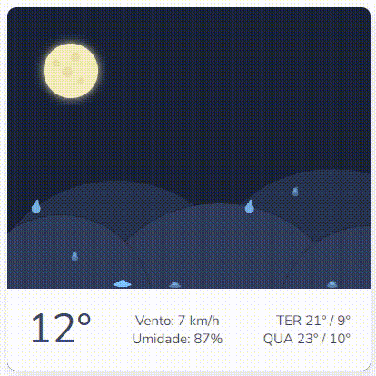

<h1 align="center"> Desafio 09 </h1>

Desafio 09 - Previsão do tempo (chuva)

## 🚀 Tecnologias

Esse projeto foi desenvolvido com as seguintes tecnologias:

- HTML e CSS

## 💻 Projeto

  Desafios para testar o conhecimento em front-end proposto pelo site [100 Days css](https://100dayscss.com/)

---

Feito com ♥ by Antonio Inácio
